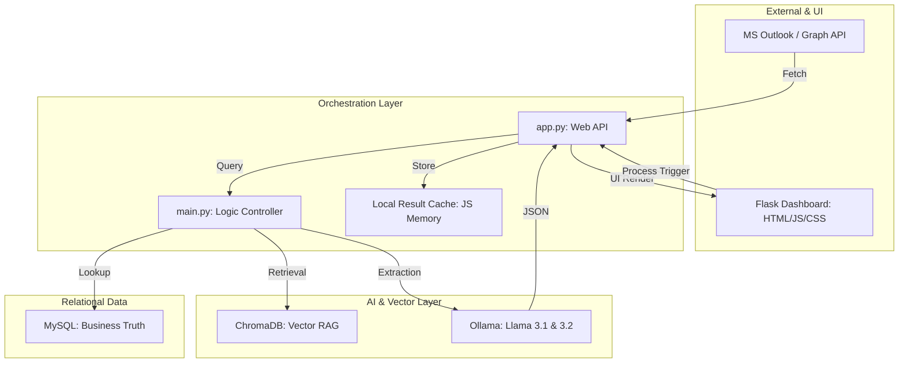

# EmailDataExtractor 📧🤖 (Branch: Fix-Dups)

An advanced, production-grade AI Email Orchestration Platform. This platform features a fully-realized multi-stage agentic pipeline, a **RAG-enhanced Flask Dashboard**, a highly robust database deduplication state machine, and a human-in-the-loop draft editor.

---

## 📊 Project Workflow & Stages

Our architecture partitions email analysis into discrete agentic phases to ensure logical execution, eliminate model hallucinations, and guarantee data safety:

```
[Outlook Fetch] ──> [Stage 0: Deduplication] ──> [Stage 1: Strategy] ──> [Stage 2: Extraction] ──> [Stage 3: Drafting] ──> [Human Review & Send]
```

### 1. Stage 0: Deduplication (Deterministic & Entity-Level Overrides)
Before launching heavy LLMs, the platform runs a **prioritized state machine** comparing the message ID, conversation thread, and ChromaDB vector semantics.
*   **Safety Overrides:** Instantly overrides decisions to `DUPLICATE` if highly similar semantic records exist, stopping logic flips on small models.
*   **LLM Bypass & Early Exit [NEW]:** If a duplicate is confirmed by Stage 0, the pipeline immediately halts and bypasses Stages 1 and 2 (saving heavy LLM compute). It reconstructs the dashboard view directly from VectorDB's metadata, while still safely logging the new message into MySQL to ensure reply status updates work perfectly.
*   **State Alignment:** Resolves the status of semantically similar emails across different conversation threads to identify whether an inquiry has already been replied to, showing a red warning outline.
*   **Bulletproof Entity ID Matching [NEW]:** Directly queries ChromaDB metadata for past emails referencing the exact same `invoice_id` or `tracking_id` parsed from the active body. If any past matching thread is `REPLIED` or `PENDING` in MySQL, it forces the corresponding `DUPLICATE` state, fully protecting against cross-thread duplication.

### 2. Stage 1: Strategy Mapping
The agent reads the email content, evaluates the RAG contexts, and maps a support strategy (e.g. tracking dispute, payment issue, cancel order).
*   **Strategic Agent Prompts:** Updated to guide the agent to dynamically leverage new strategic tools (`check_thread_history` and `get_customer_invoices`) during analysis turns.

### 3. Stage 2: Entity Extraction & Dynamic Tools
The agent acts autonomously to retrieve missing information from database systems.
*   **Dynamic Tool Filtering:** Automatically strips document text extraction tools if the target email has no attachments, preventing hallucinated base64 execution errors.
*   **Self-Healing Parameters:** Wrap functions with parameter-aliasing robust kwargs (e.g. mapping `id` or `invoice_number` to `invoice_id`), eliminating Python positional crashes.

### 4. Stage 3: Live Draft Generation
Generates replies based strictly on pre-fetched business data from relational databases, preventing redundant tool loops and hallucinated invoice numbers.

---

## 🌟 Key Features & Toolsets

### 🔐 100% Headless MSAL Authentication (Personal & Enterprise)
Bypasses constant browser windows by utilizing a **persistent absolute-path token cache** (`token_cache.bin` next to `main.py`).
*   **Silent Extraction:** After logging in once through the browser, the Public Client app silently refreshes and extracts tokens in less than `0.2s` from the cache, enabling true headless background daemon service for personal `@outlook.com` / `@hotmail.com` accounts.
*   **ASCII Safe Logging:** Eliminates terminal emoji characters (e.g. `🛠️` in tool logs) to ensure complete compatibility across Windows command prompts, avoiding charmap encoding errors.

### 🧠 RAG-Enhanced Semantic Memory (ChromaDB)
*   Queries ChromaDB to locate semantically similar historic threads from the same customer.
*   Uses a strict data firewall to prevent "context bleeding" across different accounts.

### 🗃️ Business Relational Source-of-Truth (MySQL)
Validates every extracted invoice ID, tracking number, and customer profile against live tables.
*   **`get_customer_invoices(email)` [NEW]:** Fetches a customer's entire historical invoice portfolio to resolve general inquiries when no specific ID is mentioned.
*   **`check_thread_history(conversation_id)` [NEW]:** Pulls the chronological intent and lifecycle log of the active conversation thread.

### 🖥️ Premium Glassmorphism Dashboard
*   **Interactive Editing:** Direct in-place editing of AI-generated responses before sending.
*   **Conditional Badges:** Dynamic, clean status styling showing `PROCESSED (PENDING REPLY)` or `THREAD ALREADY REPLIED` based on database history.

### 🛡️ Client Resilience
*   Increased streaming timeouts and browser connection watchdogs to **90 seconds** to wait for sequential multi-turn model execution on slower local hardware.
*   Protected replied status updates using safe MySQL updates: `status = IF(status = 'REPLIED', 'REPLIED', VALUES(status))`.

---

## 🏗️ System Architecture



---

## ⚙️ Setup & Configuration

### Dependencies
```bash
pip install flask msal ollama mysql-connector-python chromadb beautifulsoup4
```

### Running the Platform
1. Ensure MySQL and your local Ollama instance are running.
2. Launch the Flask server:
   ```bash
   python app.py
   ```
3. Open `http://localhost:5000` in your web browser.

---
*Created by [Smartchronon24](https://github.com/Smartchronon24)*
