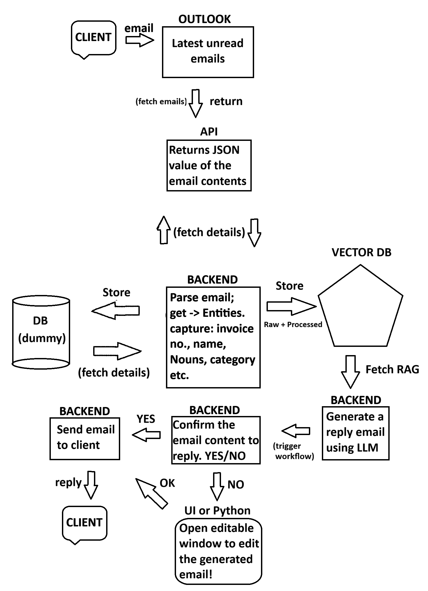

# EmailDataExtractor 📧🤖 (Branch: RAG&UIUXv1)

An advanced, production-grade AI Email Orchestration Platform. This version transforms the project from a terminal-based script into a **RAG-enhanced Flask Dashboard** with a professional "Human-in-the-Loop" workflow.

## 📊 Project Workflow v2.0



## 🌟 Key Features

### 1. RAG-Enhanced Intelligence (ChromaDB) 🧠
- **Semantic Memory**: Uses ChromaDB to store and retrieve past email communications.
- **Contextual Grounding**: Automatically injects relevant historical context into the AI's reply generator to ensure consistency with previous brand messaging.
- **Data Firewall**: A strict prompt engineering layer that prevents "context bleeding"—ensuring the AI never uses names or IDs from old emails in new replies.

### 2. Premium Flask Dashboard 🖥️
- **Dual-Panel UI**: A sleek, glassmorphism-themed interface for browsing fetched emails and performing deep analysis.
- **Live Preview**: Read raw emails with preserved formatting (newlines/paragraphs) before triggering the AI.
- **Interactive Editing**: Directly edit AI-generated drafts in a content-editable editor before sending.

### 3. Human-in-the-Loop Workflow 🤝
- **Phase 1: Fact Extraction**: Trigger AI to extract Intent, Category, Summary, and look up matching records in MySQL.
- **Phase 2: Review**: Verify the AI's understanding and database matches (Invoices/Shipments).
- **Phase 3: Generate & Approve**: Trigger Llama 3 to draft the final reply once the context is verified.

### 4. Hybrid Fact-Checking Engine 🛡️
- **Deterministic Regex Safety Net**: Scans for customizable ID patterns (INV, TRK, etc.) to catch what the LLM might miss.
- **MySQL Source-of-Truth**: Validates every extracted invoice and shipment ID against your live production database.

## 🏗️ System Architecture


## ⚙️ Setup & Configuration

### Dependencies
```bash
pip install flask msal ollama mysql-connector-python chromadb beautifulsoup4
```

### Configuration (`config.py`)
| Variable | Description |
|----------|-------------|
| `ENABLE_STAGE1` | Toggle Mistral Stage 1 analysis. |
| `STAGE2_MODEL` | Set your main extraction model (e.g., `llama3`). |
| `INVOICE_PREFIXES` | Add custom invoice prefixes (e.g., `["BILL", "INV"]`). |
| `CHROMA_PATH` | Directory for the Vector database. |

## 🚀 Running the Platform
1. Ensure your MySQL server and Ollama are running.
2. Start the web server:
   ```bash
   python app.py
   ```
3. Visit `http://localhost:5000` in your browser.

---
*Created by [Smartchronon24](https://github.com/Smartchronon24)*
