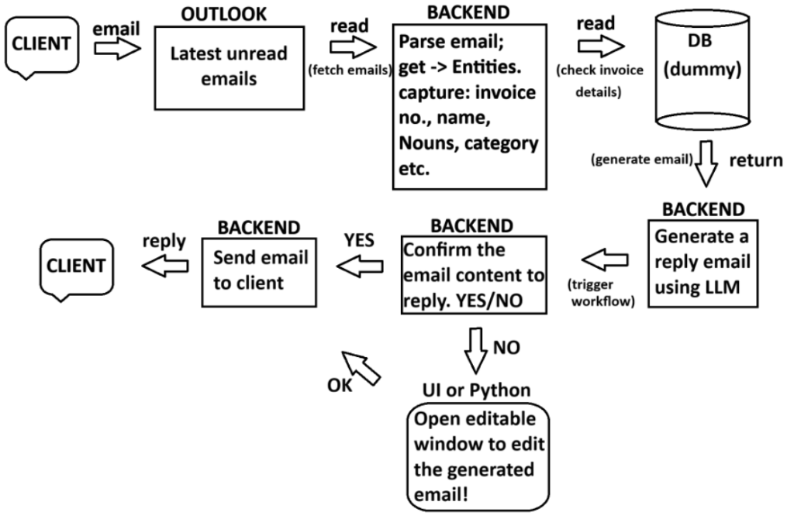
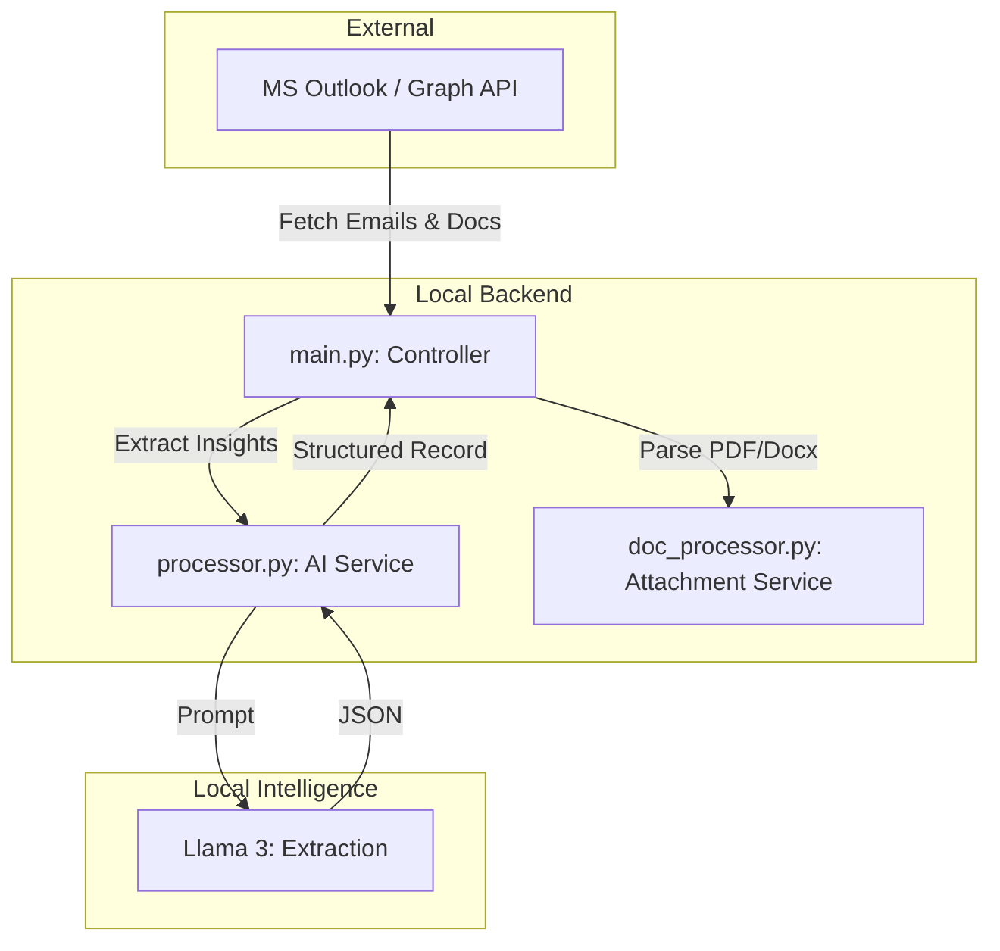

# EmailDataExtractor 📧🤖 (Doc-Process Branch)

An intelligent, automated email processing pipeline that fetches emails from Microsoft Outlook, extracts structured insights from email bodies, and performs **Deep Document Extraction** from attachments (PDF and DOCX).

## 📊 Project Workflow



## 🚀 Key Features

- **Multi-Format Attachment Parsing**: 
    - **PDF Extraction**: Uses `pypdf` to intelligently read text from PDF invoices and documents.
    - **DOCX Extraction**: Uses `python-docx` to parse text from Microsoft Word attachments.
    - **AI Context Integration**: Extracted document text is appended to the email body before being processed by the AI.
- **Intelligent Entity Extraction**: Uses **Llama 3** (via Ollama) to extract:
    - **Intent & Category**: Identifies the primary purpose and classification of the email.
    - **Dynamic Entities**: Automatically identifies Names, IDs, Amounts, and specific domain data.
- **Parallel Processing**: Utilizes concurrent workers to process multiple emails and documents simultaneously.
- **Data Layering**:
    - **Bronze Layer**: Raw JSON fetched from API (including raw attachment data).
    - **Silver Layer**: Structured, AI-processed JSON records.

## 🏗️ Architecture

The project follows a modular **MVC-inspired** structure:



- **`main.py`**: The Controller. Orchestrates the pipeline and handles the Graph API communication.
- **`processor.py`**: The AI Service. Handles HTML cleaning and LLM extraction logic.
- **`doc_processor.py`**: The Document Service. Contains the logic for parsing PDFs and Word files.
- **`config.py`**: The Configuration Layer. Centralized settings for model names and paths.

## 🛠️ Setup Instructions

### 1. Prerequisites
- Python 3.11+
- [Ollama](https://ollama.com/) with the `llama3` model.
- Microsoft Azure App registration (`Mail.Read` scopes).

### 2. Installation
```bash
git clone -b doc-process https://github.com/Smartchronon24/EmailDataExtractor.git
cd EmailDataExtractor
pip install msal requests beautifulsoup4 ollama pandas pypdf python-docx
```

### 3. Usage
```bash
python main.py
```
- The script will fetch emails from your Outlook.
- It will automatically detect attachments, extract their text, and pass everything to Llama 3.
- Results are saved to `processed_emails.json`.

---
*Created by [Smartchronon24](https://github.com/Smartchronon24)*
