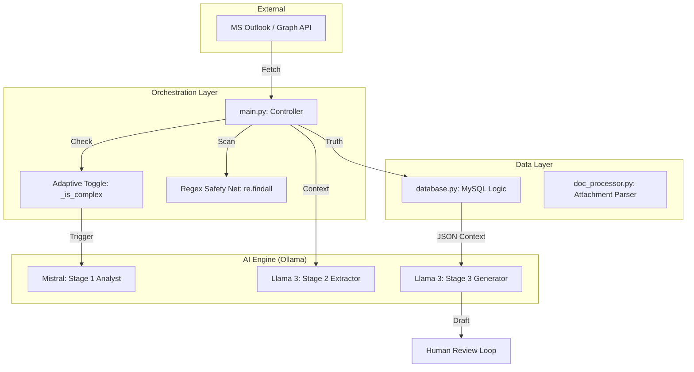

# EmailDataExtractor 📧🤖 (Branch: replyAND2stage)

An advanced, production-grade email automation suite. This version (v2.0) introduces an **Adaptive Multi-Stage Pipeline**, a **Deterministic Regex Safety Net**, and a **Context-Aware Reply Engine**. 

It transitions the project from simple document parsing to a high-reliability system capable of handling complex enterprise workflows.

## 📊 Project Workflow

## 🛠️ Major Technical Implementations

### 1. Adaptive Two-Stage Orchestration ⚡
The system now intelligently evaluates computational cost before processing.
- **Stage 1 (Mistral 7B)**: Performs high-level analysis to determine intent, priority, and data presence.
- **Adaptive Toggle (`_is_complex`)**: A heuristic engine that evaluates:
    - **Payload Size**: Emails > 600 characters are automatically marked as "Complex."
    - **Attachment Presence**: Any email with PDF/Docx text is routed through Stage 1.
    - **Data Density**: If more than 10 numeric patterns are detected, Stage 1 is triggered to provide context hints to Stage 2.
- **Optimization Controls**: Use `OPTIMIZE_STAGE1` in `config.py` to switch between "Adaptive" and "Brute Force" (Always On) modes.

### 2. Deterministic Regex Safety Net 🛡️
To solve the problem of AI non-determinism, we implemented a rule-based fail-safe.
- **Pattern Matching**: Scans raw text for customizable ID patterns (e.g., `INV-123`, `TRK-456`).
- **Dynamic Configuration**: `INVOICE_PREFIXES` and `TRACKING_PREFIXES` in `config.py` allow you to add new identifiers (like `BILL` or `PO`) without touching the core code.
- **Hybrid Merging**: The system merges results from both the AI and the Regex scanner, ensuring critical IDs are never missed.

### 3. Smart Database Layer & Normalization 🗄️
The database has been optimized for performance and data integrity.
- **Normalization**: Removed redundant `customer_name` from the `invoices` table. Name data is now pulled via a high-performance `JOIN` on `customer_id`.
- **Semantic Column Shift**: Renamed `delay_reason` to `progress`. This changes the AI's bias from always apologizing to providing neutral, factual status updates (e.g., "Enroute and Before Schedule").
- **Indexing**: Added unique indexes on `email` and foreign key indexes on `customer_id` and `tracking_id` for sub-millisecond lookups.

### 4. Enterprise-Grade Reply Engine ✍️
The Stage 3 Generator is now governed by strict professional writing rules.
- **Conciseness**: Forbidden from using filler phrases like "According to our records."
- **Minimalist Loyalty**: Replaced long loyalty paragraphs with single-sentence, premium shoutouts (e.g., "As a Platinum member, we appreciate your continued loyalty.").
- **Post-Processing Cleanup**: A Python-based cleanup layer automatically strips AI-generated filler lines (e.g., "Here is the concise email reply...") before the draft is presented for review.
- **Context Injection**: Passes the full `db_context` as a structured JSON block to the AI, allowing it to "see" the relationships between invoices and shipments.

## 🏗️ Architecture

## ⚙️ Configuration Parameters (`config.py`)

| Variable | Description |
|----------|-------------|
| `ENABLE_STAGE1` | Global killswitch for Mistral analysis. |
| `OPTIMIZE_STAGE1` | Enables/Disables the Adaptive complexity toggle. |
| `INVOICE_PREFIXES` | List of prefixes for the Regex ID scanner (e.g., `["INV", "BILL"]`). |
| `TRACKING_PREFIXES` | List of prefixes for the Shipment scanner (e.g., `["TRK", "SHIP"]`). |

---
*Created by [Smartchronon24](https://github.com/Smartchronon24)*
