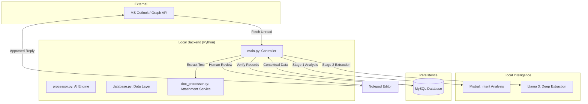
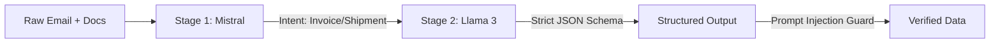
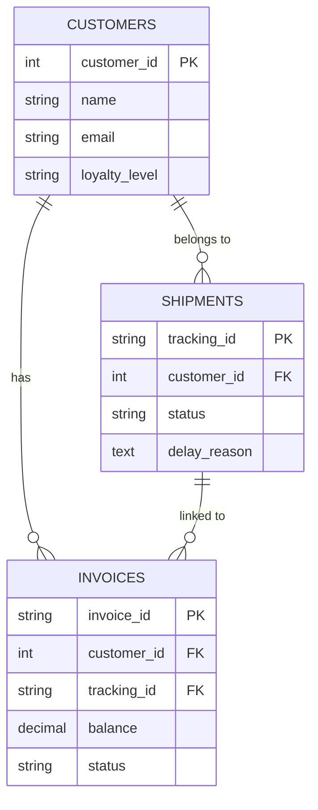

# EmailDataExtractor 📧🤖

An intelligent, automated email processing pipeline that fetches emails from Microsoft Outlook, extracts structured insights using a Two-Stage Local LLM pipeline, verifies data against a MySQL database, and facilitates human-in-the-loop reviews before sending automated replies.

## 📊 Project Workflow


## 🚀 Key Features

- **Two-Stage AI Pipeline**: 
    - **Stage 1 (Mistral)**: Intent classification and routing.
    - **Stage 2 (Llama 3)**: Deep entity extraction (Invoices, Shipments, Feedback).
- **MySQL Database Integration**: Real-time verification of invoice status, customer loyalty levels, and shipment tracking.
- **Human-in-the-Loop (HITL)**: Interactive terminal review loop with **Notepad integration** for editing AI-generated drafts.
- **Automated Fetching & Dispatch**: Fetches unread emails from the Inbox and sends threaded replies via Microsoft Graph API.
- **Security Hardened**: Protected against **Prompt Injection** attacks using XML-style delimiters and strict system rules.
- **Data Layering**:
    - **Bronze Layer**: Raw JSON fetched from API.
    - **Silver Layer**: Structured extraction results.
    - **Gold Layer**: Verified records and dispatched replies.

## 🏗️ Architecture

The project follows a modular **MVC-inspired** structure, separating API communication, AI processing, and data persistence.

### 1. System Overview


### 2. Two-Stage AI Pipeline
To ensure high accuracy and security, extraction is handled in two distinct phases:



### 3. Database Schema (ERD)
The system uses a relational model to link billing data with logistics and customer profiles:



## 🛠️ Setup Instructions

### 1. Prerequisites
- Python 3.11+
- [Ollama](https://ollama.com/) with `llama3` and `mistral` models.
- MySQL Server (local or remote).
- Microsoft Azure App registration (`Mail.Read`, `Mail.Send`, `Mail.ReadWrite`).

### 2. Installation
```bash
git clone https://github.com/Smartchronon24/EmailDataExtractor.git
cd EmailDataExtractor
pip install msal requests beautifulsoup4 ollama mysql-connector-python pandas
```

### 3. Database Setup
Run the provided SQL scripts in MySQL Workbench to create the `customers`, `invoices`, and `shipments` tables.

## 📂 Usage

### Run the Pipeline
```bash
python main.py
```
- The script will fetch unread emails.
- It will perform database lookups for any detected Invoice IDs or Tracking Numbers.
- If `ENABLE_REPLY_GENERATION` is True, it will prompt you to **Approve**, **Skip**, or **Edit** (via Notepad) the reply.

## 🛡️ Security
This project uses multi-layer security:
- **Prompt Injection Guards**: Strict rules prevent the LLM from obeying instructions embedded in email bodies.
- **Local Inference**: All data processing stays on your machine via Ollama.
- **Credential Isolation**: `KEYS.py` is excluded from version control to protect your API secrets.

---
*Created by [Smartchronon24](https://github.com/Smartchronon24)*
